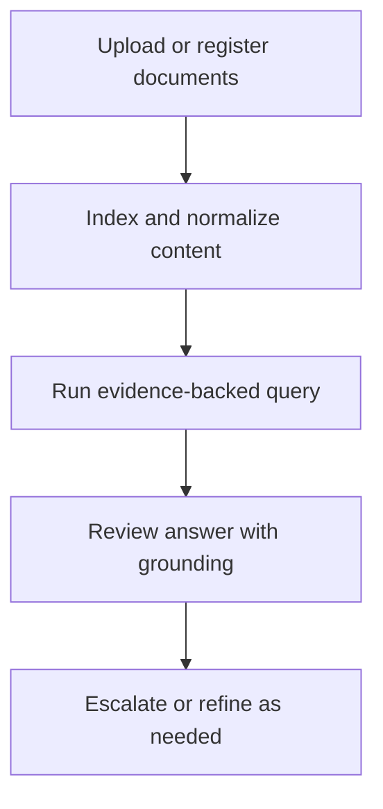

# Workflow

## High-level functional workflow
1. Upload or register documents
2. Index and normalize content
3. Run evidence-backed query
4. Review answer with grounding
5. Escalate or refine as needed

## Publication boundary
- The workflow is intentionally simplified.
- No internal rules, private thresholds, or sensitive processing detail are described here.
